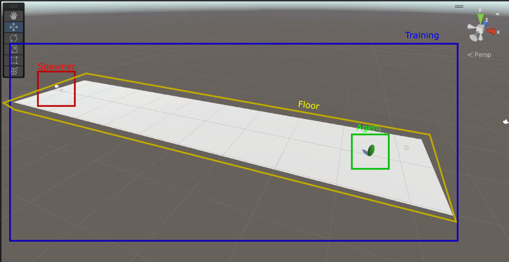
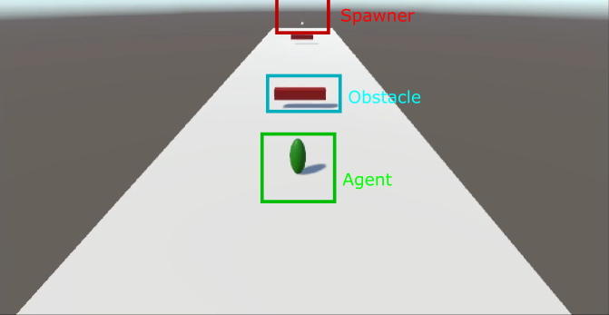
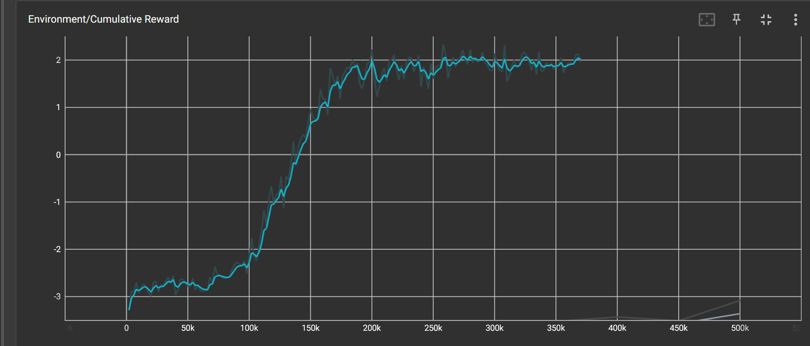

# Jumper Assignment
*Noah Dekens & Daniel Garriga*

In this assignment we created an agent that automatically jumps over obstacles moving into a straight line at varying distances and different speeds per episode.

## Documentation

### Setup

First of all we created the training area, which contains a floor, an agent, and a spawner. The agent has a few standard components, a sphere collider, a rigidbody with some constraints to lock everything besides y-axis movement, a ray-perception sensor 3D with just a single ray forwards and 5 stacked raycasts.

The agent also includes the agent script *JumperAgent*, the Behavior Parameters with 1 discrete branch of size 2 which we used for the jump action. And finally it has the decision requester with a decision period of 5.

### Code

The project contains 3 scripts, the JumperAgent, the Obstacle, and the SpawnerBehaviour.

The JumperAgent script is the main script containing a few serialized fields for various properties like the jump force, rewards, and the spawner count. When the episode starts the agent and spawner get reset and all the obstacles get destroyed.

In the OnActionReceived method we get the discrete actions and use it to determine whether we should jump if not, depending on the current state and discrete actions the agent can call the Jump method. In the Heuristic method we just check if spacebar is pressed and set the discrete action accordingly.

There is a method CheckEpisodeDuration which ensures that the episode end once a certain amount of obstacles have been spawned. We don't collect any observations since the agent only needs the information provided by the ray-perception sensor.

Then finally there is the Jump method which adds a certain amount of impulse force to the rigidbody depending on the jumpForce.

Following the agent script we have the SpawnerBehaviour script, which picks a random speed at the start to provide to any obstacles it spawns, then it starts a coroutine that spawns an obstacle randomly every few seconds in a time range. Spawning the obstacle uses a simple Instantiate call and loads the obstacle prefab from Resources. It sets the obstacle's position and then calls the agent function CheckEpisodeDuration to ensure that after a certain amount of spawned obstacles the episode will end

Lastly there is the Obstacle script, which sets the velocity of its rigidbody on start and then in the Update method sets it again to maintain constant velocity. If the distance travelled passes a certain velocity it will give a reward to the agent.

### Rewards

The agent uses a few rewards and penalties (negative rewards) to ensure that it can train properly.

First of all, each time an obstacle disappears because it passed the agent, the agent gets a reward of 1 to indicate that it managed to jump over the obstacle. Secondly, when the agent touches the obstacle, it gets a penalty of 1 to make sure the agent tries to jump over the obstacles.

Then finally to ensure that the agent doesn't keep jumping, a penalty of 0.5 is applied.

### Training

While there was a rather slow start between 0 and 100k steps, the model started rapidly learning between 100k and 200k steps, going from a cumulative reward of -2 to 2, after which it remained quite steady from 200k to ~360k, at which point we stopped the training.

### Results

The agent appears to have successfully learned jumping over the obstacles even with varying speeds and randomly chosen distances between the obstacles.